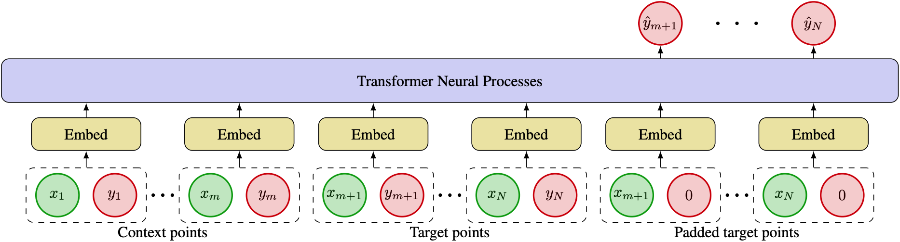

# Transformer Neural Processes: Uncertainty-Aware Meta Learning Via Sequence Modeling

This is the official implementation of the paper [Transformer Neural Processes: Uncertainty-Aware Meta Learning Via Sequence Modeling](https://arxiv.org/abs/2207.04179) in Pytorch. We propose Transformer Neural Processes (TNPs), a new member of the Neural Processes family that casts uncertainty-aware meta learning as a sequence modeling problem. We learn TNPs via an autoregressive likelihood-based objective and instantiate it with a novel transformer-based architecture. TNPs achieve state-ofthe-art performance on various benchmark problems, outperforming all previous NP variants on meta regression, image completion, contextual multi-armed bandits, and Bayesian optimization.



## Install

First, clone the repository:

```
git clone https://github.com/tung-nd/TNP-pytorch.git
```

Then install the dependencies as listed in `env.yml` and activate the environment:

```
conda env create -f env.yml
conda activate tnp
```

## Usage

Please check the directory of each task for specific usage.

## Citation

If you find this repo useful in your research, please consider citing our paper:
```
@article{nguyen2022transformer,
  title={Transformer neural processes: Uncertainty-aware meta learning via sequence modeling},
  author={Nguyen, Tung and Grover, Aditya},
  journal={arXiv preprint arXiv:2207.04179},
  year={2022}
}
```

## Acknowledgement

The implementation of the baselines is borrowed from the official code base of [Bootstrapping Neural Processes](https://github.com/juho-lee/bnp).